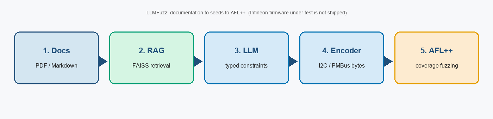
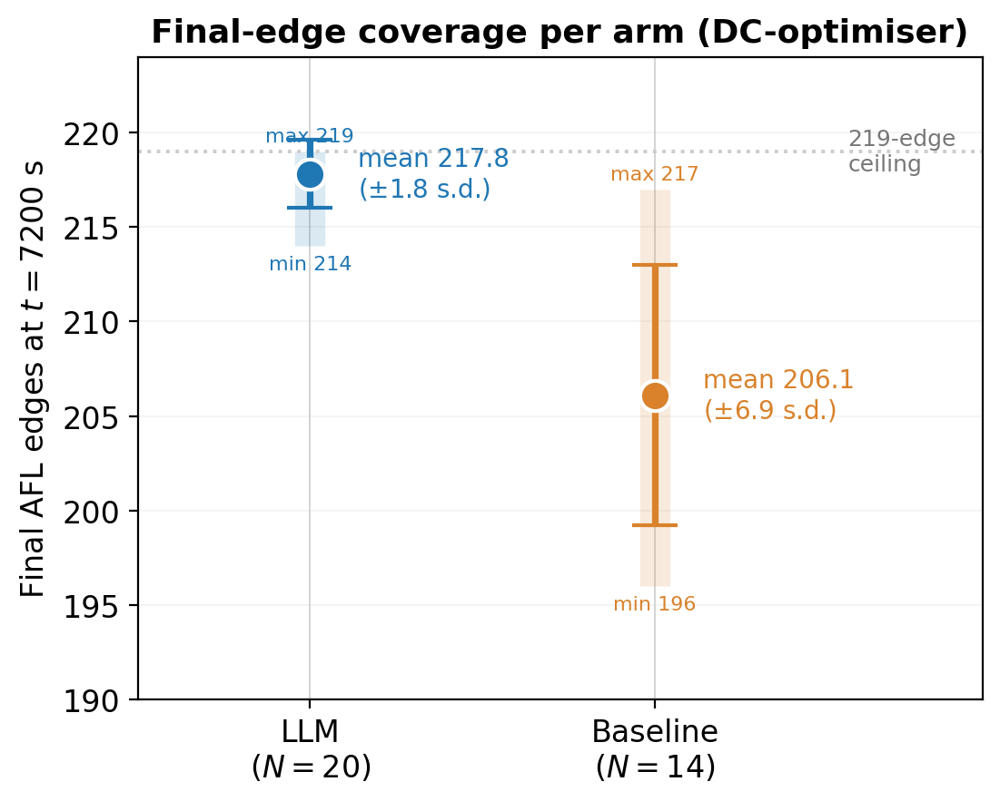
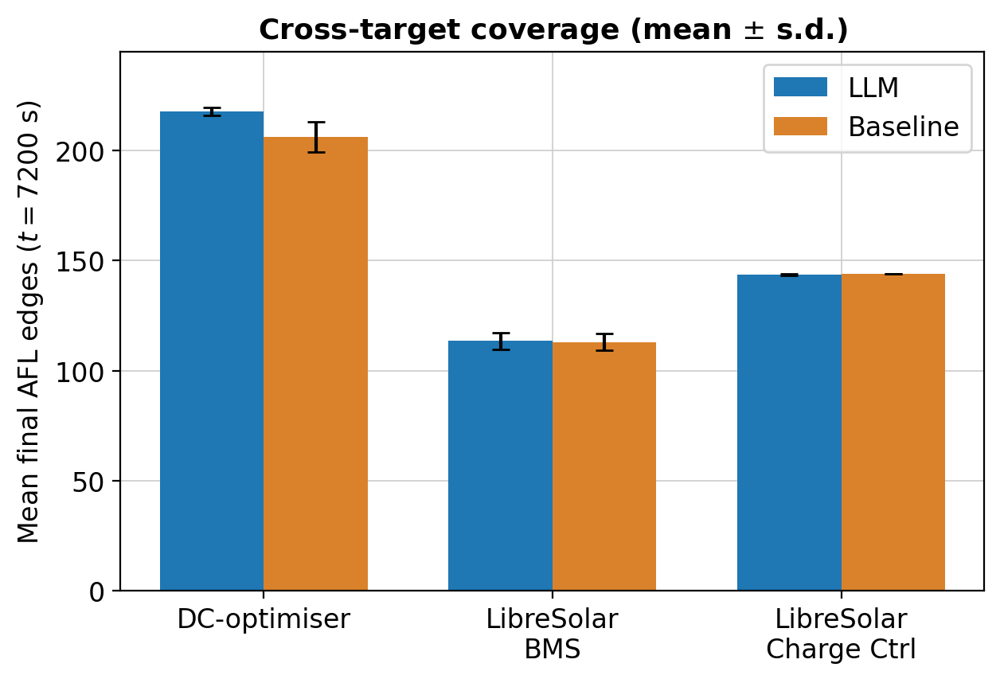

# LLMFuzz

[](LICENSE)
[](https://www.python.org/downloads/)
[](https://github.com/harshjoshi23/LLMFuzz/actions/workflows/ci.yml)

Turn firmware **datasheets** into **AFL++ seeds**. Retrieval plus an LLM extracts typed protocol constraints; a deterministic encoder writes the bytes; AFL++ does the fuzzing.

Companion code for the FAU M.Sc. thesis and the STVR manuscript *From Datasheets to Seeds* ([STVR](https://onlinelibrary.wiley.com/journal/10991689) — in preparation).



## Three targets

The evaluation used **three** protocol harnesses. All three project files and indexes are in this repo.

| # | Project | What ships here | Role in the study |
|---|---------|-----------------|-------------------|
| 1 | `infineon-dc-optimizer` | Sanitized **harness facsimile** + public RAG chunks. Infineon firmware under test is **not** on GitHub. | Primary result (confirmatory) |
| 2 | `libresolar-bms` | Public LibreSolar BMS snapshot + harness | Exploratory transfer |
| 3 | `libresolar-charge-controller` | Public LibreSolar charge-controller snapshot + harness | Exploratory transfer |

Why the Infineon tree is a stub: Infineon hosts that firmware on their own portal. The primary study used the sanitized facsimile `src/harness/fuzz_dc_optimizer_protocol.c`. Reruns exercise the same method; they are not a bit-identical recreation of the reported sample (see [`REPRODUCIBILITY.md`](REPRODUCIBILITY.md)).

| Project YAML | Harness | Protocol |
|--------------|---------|----------|
| `projects/infineon-dc-optimizer.project.yaml` | `src/harness/fuzz_dc_optimizer_protocol.c` | I²C / PMBus |
| `projects/libresolar-bms.project.yaml` | `src/harness/fuzz_bms_protocol.c` | I²C |
| `projects/libresolar-charge-controller.project.yaml` | `src/harness/fuzz_charge_controller_protocol.c` | I²C |

## Highlights

On the **primary** (DC-optimizer) harness, documentation-grounded seeds vs a 64-byte zero-filled baseline (2 h budget):

- Final edges: **217.8 ± 1.8** (N=20) vs **206.1 ± 6.9** (N=14)
- Median time to 200 edges: **60 s** (20/20) vs **4139 s** (13/14) → about **69×** at that milestone only
- Mann–Whitney *p* = 2.08 × 10⁻⁶, Vargha–Delaney A₁₂ = 0.971

This is **coverage acceleration**, not bug finding. Public-target finals tied; see the paper.

<p align="center">
  
  
</p>

## Quick start

```bash
bash install.sh
source .venv/bin/activate
cp .env.example .env.local   # any OpenAI-compatible chat API
python -m src.cli doctor

THESIS_LLM_ENABLED=1 python -m src.cli \
  --project projects/infineon-dc-optimizer.project.yaml \
  fuzz --protocol i2c --duration 180 --run-id smoke_test
```

Offline / CI: `THESIS_LLM_ENABLED=0`. Tests: `PYTHONPATH=. pytest tests/ -q`.

## Layout

| Path | Purpose |
|------|---------|
| `src/cli.py`, `src/pipeline.py` | Thesis evaluation path (use this) |
| `run_pipeline.py` | Optional closed-loop lab path (not in the reported stats) |
| `data/vectorstore_projects/` | Pre-built FAISS indexes for all three targets |
| `src/harness/` | C protocol harnesses for AFL++ |
| `targets/` | LibreSolar snapshots + Infineon path stub |
| `scripts/` | 2 h / 24 h campaign launchers |
| `tests/` | Unit tests (no API keys) |

## LLM provider

Any OpenAI-compatible Chat Completions endpoint in `.env.local`. Example with [Ollama](https://ollama.com/):

```bash
GPT4IFX_BASE_URL=http://localhost:11434/v1
GPT4IFX_API_KEY=ollama
THESIS_LLM_PRIMARY_MODEL=qwen2.5-coder:7b
```

Re-index your own docs with `python -m src.cli index --project projects/<name>.project.yaml`. Do not commit proprietary PDFs.

## Reproducibility

Commands to **rerun the released pipeline**: [`REPRODUCIBILITY.md`](REPRODUCIBILITY.md).
Those commands reproduce the **method**, not a bit-identical copy of the historical
STVR sample (\(N{=}20/14\), two-hour primary comparison). Original per-trial AFL++
files are not in this repository. Infineon proprietary firmware and documentation
are not distributed. Architecture: [`docs/ARCHITECTURE.md`](docs/ARCHITECTURE.md).

## Authors

- **Harshvardhan Joshi** — FAU Informatik 7 and Infineon Technologies AG
- **Mojdeh Golagha** — Infineon Technologies AG (PSS, CRD SIS SWT)
- **Loui Al Sardy** — FAU, Computer Networks and Communication Systems (Informatik 7)

## License

MIT — [`LICENSE`](LICENSE). LibreSolar trees keep their upstream licenses. Infineon firmware under test is not redistributed.

## Citation

```bibtex
@mastersthesis{joshi2026llmfuzz,
  author = {Joshi, Harshvardhan},
  title  = {Retrieval Augmented {LLM} Seed Generation for Coverage-Guided Fuzzing of Embedded Power-Conversion Firmware},
  school = {Friedrich-Alexander-Universit{\"a}t Erlangen-N{\"u}rnberg},
  year   = {2026},
  note   = {Computer Networks and Communication Systems (Informatik 7)}
}
```
