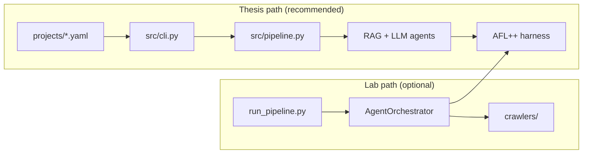

# LLMFuzz

[](LICENSE)
[](https://www.python.org/downloads/)

Retrieval-augmented LLM pipeline that turns firmware documentation into AFL++ seed corpora for coverage-guided fuzzing of embedded power-conversion firmware (PMBus / I²C).

## Authors

- **Harshvardhan Joshi** — Friedrich-Alexander-Universität Erlangen-Nürnberg (Informatik 7) and Infineon Technologies AG
- **Mojdeh Golagha** — Infineon Technologies AG (Power & Sensor Systems, CRD SIS SWT)
- **Loui Al Sardy** — Friedrich-Alexander-Universität Erlangen-Nürnberg, Computer Networks and Communication Systems (Informatik 7)

**Thesis:** *Retrieval Augmented LLM Seed Generation for Coverage-Guided Fuzzing of Embedded Power-Conversion Firmware* (M.Sc., FAU, 2026)

This is a **sanitized private release**. Infineon firmware under test is not redistributed here (Infineon hosts that snapshot on their official code portal). Evaluation of the primary target uses the protocol-harness facsimile in `src/harness/fuzz_dc_optimizer_protocol.c`.

## Highlights

On the primary sanitized DC-optimizer protocol harness, documentation-grounded AFL++ seeds reach a 200-edge milestone in **median ≈ 60 s** versus **median ≈ 4139 s** for a 64-byte zero-filled baseline — an approximately **69×** median time-to-threshold ratio at that milestone only (Mann–Whitney *p* = 2.08 × 10⁻⁶, Vargha–Delaney A₁₂ = 0.971). See `REPRODUCIBILITY.md` for the evaluation protocol. This is a coverage-acceleration result, not a vulnerability-discovery claim.

## What is in this repository

| Path | Purpose |
|------|---------|
| `src/cli.py`, `src/pipeline.py` | **Thesis evaluation path** (recommended) |
| `run_pipeline.py`, `src/agents/orchestrator.py` | Optional multi-agent lab path |
| `data/vectorstore_projects/` | Pre-built FAISS indexes (three targets; DC-optimizer index is public-chunk only) |
| `src/harness/` | C harness facsimiles for AFL++ |
| `targets/` | Public LibreSolar firmware snapshots (BMS, charge controller) |
| `scripts/` | SoK-style 2 h / 24 h campaign launchers |
| `tests/` | Unit tests (run in CI without LLM keys) |

Infineon DUT sources are **not** in this tree. See `targets/README.md`.

## Quick start

```bash
bash install.sh
source .venv/bin/activate
cp .env.example .env.local   # configure your OpenAI-compatible LLM endpoint
python -m src.cli doctor

# Smoke test — sanitized DC-optimizer harness, 3 minutes
THESIS_LLM_ENABLED=1 python -m src.cli \
  --project projects/infineon-dc-optimizer.project.yaml \
  fuzz --protocol i2c --duration 180 --run-id smoke_test
```

For offline development or CI, use `THESIS_LLM_ENABLED=0` or the mock client in `src/utils/mock_llm_client.py`.

## Targets

| Project | Harness | Protocol | Notes |
|---------|---------|----------|-------|
| `infineon-dc-optimizer` | `fuzz_dc_optimizer_protocol.c` | I²C / PMBus | Primary SoK statistics; firmware under test not shipped |
| `libresolar-bms` | `fuzz_bms_protocol.c` | I²C | BQ76952 BMS extensibility |
| `libresolar-charge-controller` | `fuzz_charge_controller_protocol.c` | I²C | MPPT / charge registers |

## Two entry points



1. **`python -m src.cli`** — staged pipeline used in the thesis (`index` → `fuzz` → `report`).
2. **`python run_pipeline.py`** — closed loop with crash analysis and documentation crawlers (configure hosts via `.env.local`). The closed-loop controller was **not** part of the reported statistical campaigns.

See `docs/ARCHITECTURE.md` for component-level detail.

## LLM provider

Any OpenAI-compatible chat-completions API. Configure via `.env.local` (see `.env.example`). Supported auth modes: bearer token, OAuth2 client credentials, HTTP basic.

Example local setup with [Ollama](https://ollama.com/):

```bash
GPT4IFX_BASE_URL=http://localhost:11434/v1
GPT4IFX_API_KEY=ollama
THESIS_LLM_PRIMARY_MODEL=qwen2.5-coder:7b
```

## Re-indexing documentation

Pre-built FAISS indexes are sufficient to run `fuzz` immediately. To rebuild from your own docs:

```bash
python -m src.cli index --project projects/infineon-dc-optimizer.project.yaml
```

Place PDF or Markdown under a local docs path or configure paths in the project YAML. **Do not commit proprietary vendor PDFs.**

The shipped DC Optimizer index contains three public corpus chunks (README, parameter limits text export, firmware constants used by the sanitized harness). Internal Windchill exports were removed for this release.

## Development

```bash
source .venv/bin/activate
THESIS_LLM_ENABLED=0 pytest tests/ -q
python -m compileall -q src scripts tests
```

GitHub Actions runs syntax checks, a secrets scan, and pytest on every push to `main` (no API keys required).

## Reproducibility

Full evaluation commands — smoke test, 2 h SoK campaigns, 24 h batches, and post-processing — are in [`REPRODUCIBILITY.md`](REPRODUCIBILITY.md).

## License

MIT — see [`LICENSE`](LICENSE). Firmware under `targets/` retains upstream licenses (MIT for LibreSolar). Infineon ModusToolbox example firmware is not redistributed here.

## Citation

```bibtex
@mastersthesis{joshi2026llmfuzz,
  author = {Joshi, Harshvardhan},
  title  = {Retrieval Augmented {LLM} Seed Generation for Coverage-Guided Fuzzing of Embedded Power-Conversion Firmware},
  school = {Friedrich-Alexander-Universit{\"a}t Erlangen-N{\"u}rnberg},
  year   = {2026},
  note   = {Computer Networks and Communication Systems (Informatik 7)}
}
```
